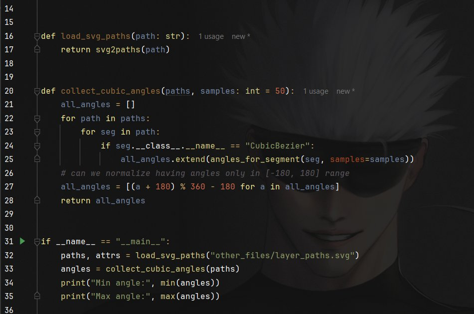

I'm a biomedical engineer who's currently attempting to finish their master's thesis after a health-related break. Joy.

**Disclaimer**: the entirety of this code was written in ungodly hours of 11 PM - 5 AM usually since I do have a 9-5 and
a desire to have some semblance of life after work, so please excuse any rough edges, weird design choices, 
and general lack of polish. I'm just trying to get this thing done half a year after I should have, and if that means
sacrificing code quality and working in ADHD-fueled bursts of energy at night, so be it.

Shoutout to my thesis reviewer who might open this repo and think "what the actual _ is this traumadumping in the readme"
should they decide to look at the previous commits.

This repository contains scripts and small tools used during the work on my master's thesis (Wrocław University of Science and Technology). It's set to
public so that I can share it with my supervisor (once it's somewhat presentable). Maybe attach the link to the actual thesis.
Technically, I probably should create a fresh repo for that, but eh, all the people who will potentially look at this repo
and care about the version history already know what kind of person I am.


Note that all the code here is written with the intention to be used in a highly specific task (retinal OCT image simulation and analysis
and, hopefully, segmentation once it's ready and polished enough),
so if you stumbled across this repo, please be aware that it may not be directly, or at all applicable to your use case. 
It's also suboptimal in many ways, probably sucks performance-wise, and I make no guarantees about anything at all. 

If you have any questions about my thesis itself, feel free to contact me (Discord: @lesnodziadyzm is probably the best way to get to me).

What is uploaded here is a version that is cleaned of comments that shouldn't be talked about in polite company, but 
still might contain rough edges, hardcoded paths, and other things that are not ideal. To be fair, this code
isn't really intended for public use since:

1 - it's part of an ongoing master's thesis with specific goals in mind.

2 - it's going to get increasingly specific as I add stuff here, but if you find 
it useful, that's great.

3 - I prioritize getting this thing FINALLY done over writing perfect, reusable code in this case. 

Oh, and the OCT image under /real_OCT is of my right eye. Feel free to admire my myoptic retina.

---


Quick setup (PowerShell)
1. Create and activate a virtual environment (recommended):

    python -m venv .venv; .\.venv\Scripts\Activate

2. Install dependencies (the repo `requirements.txt` covers some packages; add OpenCV and SciPy):

    python -m pip install --upgrade pip
    python -m pip install -r requirements.txt
    python -m pip install opencv-python scipy

Running the tools
- Interactive gamma-fit GUI (select rectangles):

    python scripts/get_shape_scale.py

  The script will open a file picker (if `tkinter` is available) or ask for paths in the console. For each named layer it shows an OpenCV window where you can click-and-drag a rectangle. Press Enter or `q` to accept a selection. The output is a JSON file you choose (commonly `gamma_parameters.json`).

- Layer editor (drag layers and auto-save positions):

    python scripts/run_editor.py

  When you close the editor it auto-saves layer positions to `json_outputs/layer_positions.json` and writes `phantom.png` as a composite image.
  By layer positions I mean the top coordinates of each layer since they all overlap.

  
Project structure (top-level)

- phantom/ - core library for phantom image creation and editing
  - config.py           : canvas size, layer order, PNG filenames and helpers
  - editor.py           : interactive layer editor GUI (drag to reposition layers)
  - image_utils.py      : functions to load PNGs, apply gamma noise and compose layers
  - layer.py, svg_analysis.py : utilities to work with layer shapes and SVGs

- scripts/ - convenience scripts and small CLIs
  - get_shape_scale.py          : interactive gamma parameter estimation from an image
  - run_editor.py               : launches the `phantom.editor` GUI
  - build_phantom_from_json.py  : create a composite PNG from `json_outputs` and gamma params
  - demo.py                     : runs the Williams 2014 edge-detection demo (heavily modified) using packaged example images
  - generate_squares.py         : small helper to generate square masks/images (used for tests/experiments)

- json_outputs/ - example JSON files created/consumed by the tools
  - gamma_parameters.json : maps layer name -> { "shape": <float>, "scale": <float> }
  - layer_positions.json  : list of objects like { "name": "NFL", "y": 123 }

- pngs/ - per-layer PNG masks (transparent areas indicate layer shape)
- gamma_layers_horizontal_squares/ - example layer PNGs for demos/tests
- real_OCT/ - real OCT image(s?) to be used as inputs
- tests/ - unit tests for the project

Scripts / tools — what they do and how to use them

1) `scripts/get_shape_scale.py`
- Purpose: interactively estimate gamma distribution parameters (shape and scale) for each named layer from a single grayscale image.
- Output: a JSON file with structure { "layer_name": { "shape": ..., "scale": ... }, ... } which you can save as `json_outputs/gamma_parameters.json`.
- Typical workflow:
  - Run: `python scripts/get_shape_scale.py` and pick an input image (for example an OCT scan or one of the PNG layer examples).
  - For each layer shown in the prompts, click-and-drag a rectangle around a homogeneous area of that layer and press Enter.
  - At the end provide an output path (default suggestion usually `json_outputs/gamma_parameters.json`) and the script writes the JSON.
- How to use later: pass this JSON to `scripts/build_phantom_from_json.py` (or `phantom.load_gamma_parameters`) so generated phantoms are filled with realistic gamma noise per-layer.

2) `scripts/run_editor.py` (interactive)
- Purpose: open a GUI that lets you drag layer PNGs vertically to set their top positions (y-coordinates). The editor shows a live composite preview.
- Output: `json_outputs/layer_positions.json` (list of `{name, y}`) and a saved `phantom.png` composite image.
- Run: `python scripts/run_editor.py` — the GUI will start (requires a desktop environment).

3) `scripts/build_phantom_from_json.py`
- Purpose: build a composite PNG from two inputs if you want to modify gamma parameters without re-running the editor.
  - a positions JSON (usually `json_outputs/layer_positions.json`), and
  - a gamma parameters JSON (usually `json_outputs/gamma_parameters.json`)
- Run example (PowerShell):

```powershell
python scripts/build_phantom_from_json.py --json json_outputs/layer_positions.json --gamma json_outputs/gamma_parameters.json --out phantom_from_json.png
```

- What it does: it loads the ordered PNG layer masks from `phantom.config` (`PNG_FILES`) and the `LAYER_NAMES`, fills each mask with gamma noise when parameters are available, and alpha-composites them onto a canvas of size `CANVAS_W` x `CANVAS_H`.
- If gamma params are missing for a layer, the script will leave that layer unfilled (transparent PNG will still be composited).

4) `scripts/demo.py`
- Purpose: demonstrate the Williams 2014 edge detection pipeline (heavily modified for my usage) using a packaged example image.
- Run: `python scripts/demo.py` — the demo will create an "attempt" folder (under the project's outputs structure) and save results (tables and images) there.
- Outputs:
  - a CSV/TSV table saved via `williams_2014_edge_detection.saving.save_table` (location printed by the script)
  - a demo visualization saved under the attempt `images/` folder (if PIL is available)

5) Other helpers
- `generate_squares.py` creates square-layer images used in tests or quick experiments.

JSON outputs — format and how to reuse them

1) `json_outputs/gamma_parameters.json` (example shape)

```json
{
    "background": {"shape": 1.2, "scale": 0.5},
    "NFL": {"shape": 2.0, "scale": 0.8},
    "GCL": {"shape": 1.8, "scale": 0.7}
}
```

- Each entry maps a layer name (string) to an object with `shape` (k) and `scale` (θ) floats for the Gamma distribution.
- Generated by `get_shape_scale.py`. Consumed by `build_phantom_from_json.py` and the `phantom` library via `load_gamma_parameters`.
- When present, layers will be filled with random gamma-sampled intensity values and then composited.

2) `json_outputs/layer_positions.json` (example shape)

```json
[
  {"name": "background", "y": 0},
  {"name": "NFL", "y": 10},
  {"name": "GCL", "y": 30}
]
```

- A list of objects describing the top Y coordinate for each named layer. The order in the list is not strictly required because the `build_phantom_from_json.py` script maps entries by `name`.
- Typically created by `run_editor.py`. Can be edited by hand if you want precise control.

How the JSONs are used together
- Typical pipeline:
  1. Use `get_shape_scale.py` on a real or synthetic image to create `gamma_parameters.json`.
  2. Use `run_editor.py` to visually position layer masks and create `layer_positions.json`.
  3. Run `build_phantom_from_json.py --json layer_positions.json --gamma gamma_parameters.json` to produce a composite phantom image.

Demo — what it does and expected outputs

- `scripts/demo.py` runs the edge-detection demo on an example image (packaged under `williams_2014_edge_detection.IMAGE_DIR`).
- It creates a timestamped/numbered "attempt" directory where metrics tables and visualizations are saved.
- Use it to validate the detection pipeline or to see a simple example of saving outputs.

Example PowerShell commands

```powershell
# Run the interactive gamma parameter picker and save to json
python scripts/get_shape_scale.py

# Launch the layer editor GUI (drag layers and close to save positions)
python scripts/run_editor.py

# Build a composite phantom from saved JSONs
python scripts/build_phantom_from_json.py --json json_outputs/layer_positions.json --gamma json_outputs/gamma_parameters.json --out phantom_from_json.png

# Run the detection demo
python scripts/demo.py

# Run unit tests
python -m pytest -q
```

Notes 
- Example inputs will be added later.
- Fun fact: originally this thing was written in MATLAB but I switched to Python like 1/3 into the thesis because I hate MATLAB. I know it's popular in DSP. I also know it's faster for computation-heavy tasks. Python has a huge advantage of not making my sanity slowly erode away as I stare at that godawful IDE for hours on end. Mine at least has Gojo in the background.



Not even joking. If you recognize the art, shame on you (love the artist though, @_lildev__ on X). If you're my supervisor or the reviewer and reading this, please don't look them up.